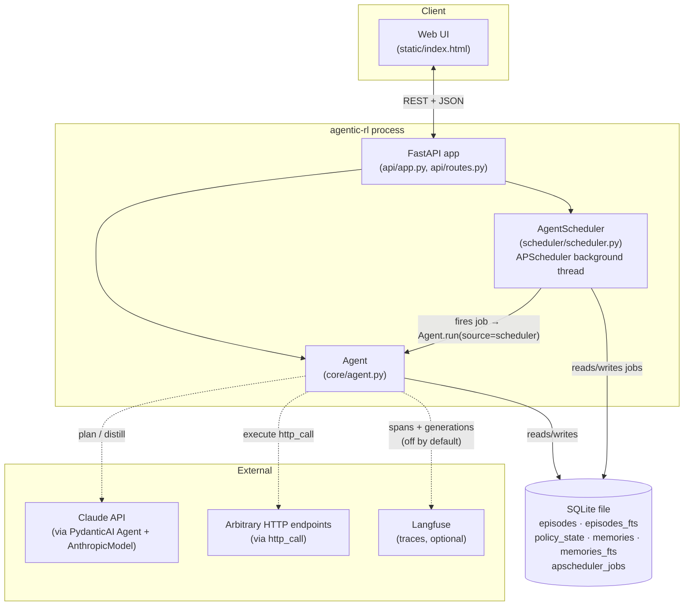
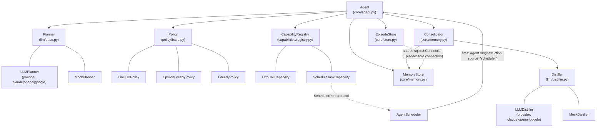
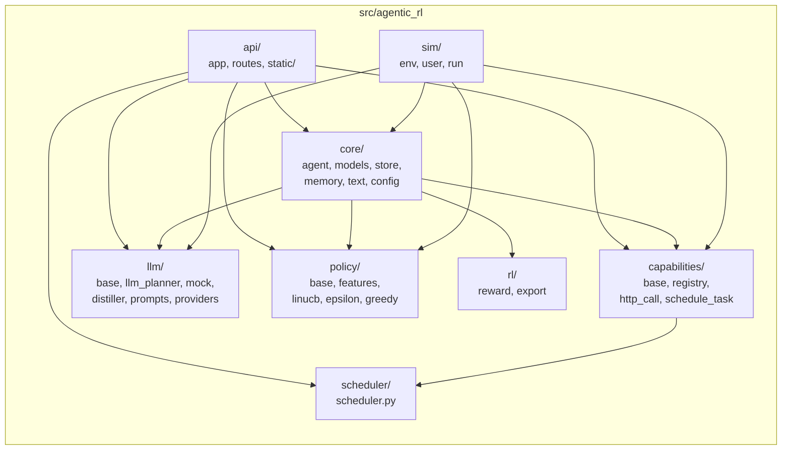
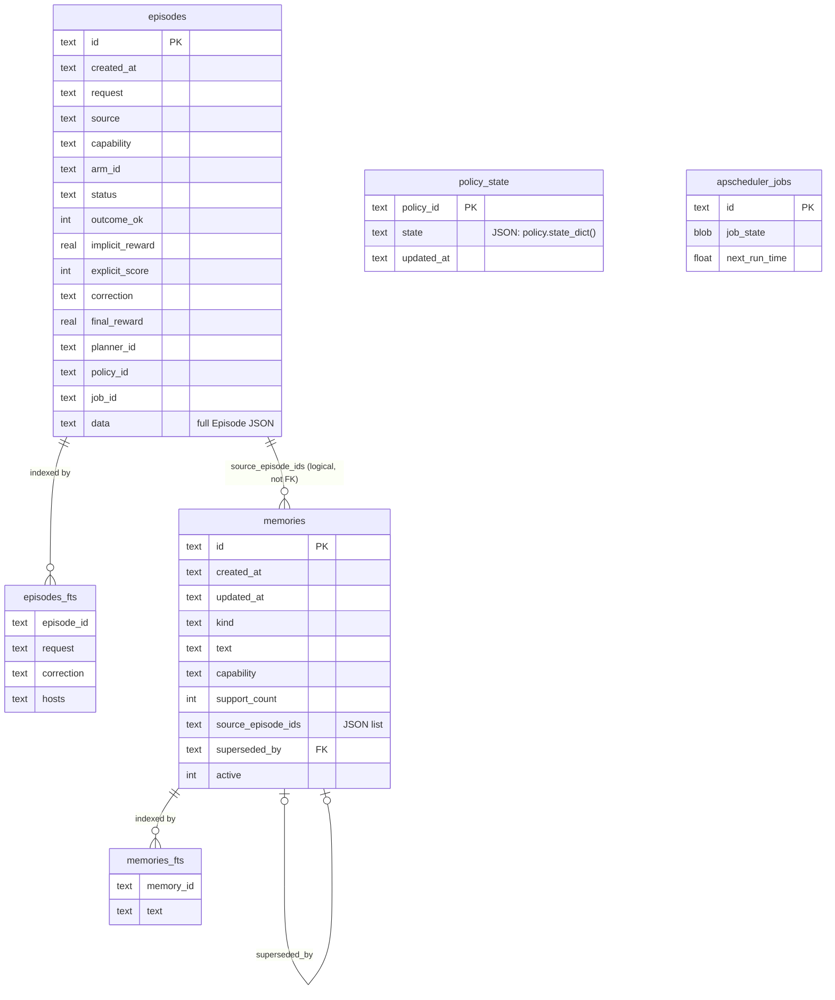
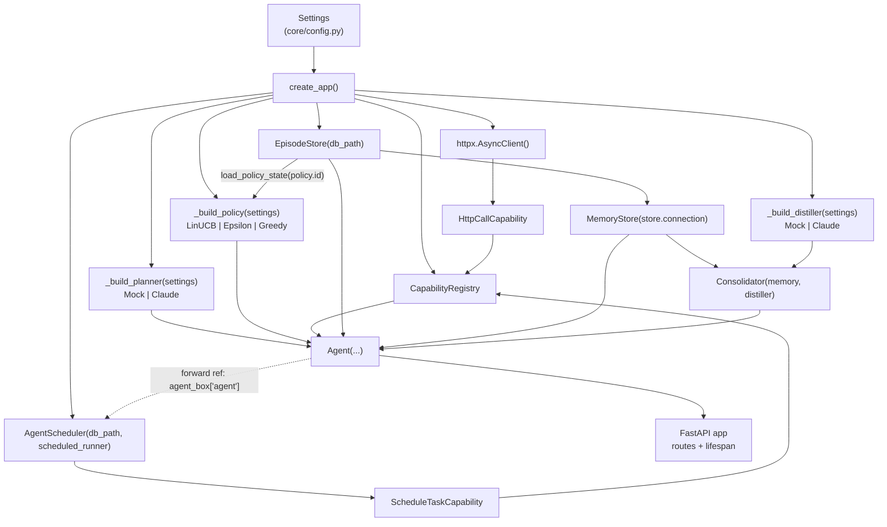
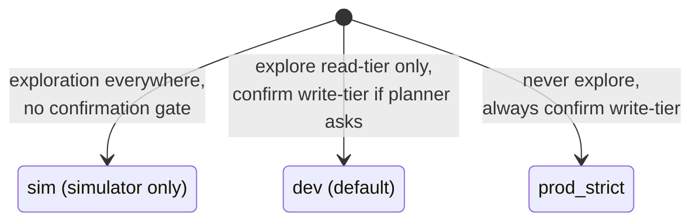

# Architecture

This document is the structural map of agentic-rl: what the pieces are, how they're
packaged, and how they're wired together at runtime. For *how requests flow through
the system step by step*, see [SEQUENCES.md](SEQUENCES.md). For the original design
rationale, see [PLAN.md](PLAN.md) and [MEMORY-PLAN.md](MEMORY-PLAN.md).

## System overview

A single Python process serves an HTTP API + static web UI, runs a background
scheduler thread, and reads/writes one SQLite file. There is no separate worker
process and no external database — the whole system fits in one `uvicorn` process
for local development and small deployments.

Langfuse tracing is entirely optional and off by default (`AGENTIC_RL_OBSERVABILITY_ENABLED=false`) —
see [OBSERVABILITY.md](OBSERVABILITY.md) for what gets traced and how to turn it on.

## Component diagram

`Agent` is the hub — it owns no state itself beyond references to its five
collaborators, and every request passes through the same object.

### LLM calls — model-agnostic via PydanticAI

`LLMPlanner` and `LLMDistiller` (`llm/llm_planner.py`, `llm/distiller.py`) are
built on [PydanticAI](https://ai.pydantic.dev)'s `Agent` + a provider `Model`
rather than calling any single vendor's SDK directly. **One `provider`
constructor argument** (`"claude"` / `"openai"` / `"google"`, driven end-to-end
by the single `AGENTIC_RL_PLANNER` setting — see `api/app.py`'s
`_build_planner`/`_build_distiller`) selects the model; everything else —
prompt construction, structured-output validation, error mapping, tracing — is
identical regardless of which one is picked. All provider-specific knowledge
lives in one place, `llm/providers.py`:

- **`build_model(provider, model_name) -> Model`** constructs the right
  PydanticAI `Model` (`AnthropicModel` / `OpenAIChatModel` / `GoogleModel`).
- **`build_settings(provider, *, max_tokens, effort) -> ModelSettings`**
  constructs the matching settings. PydanticAI has one *unified* field for
  reasoning depth, `ModelSettings.thinking`, but it doesn't carry full
  granularity for every provider — verified by reading the installed SDK, not
  assumed:
  - **Claude**: any truthy `thinking` value just switches on adaptive
    thinking for adaptive-capable models (the specific effort level is
    dropped in that branch), so Claude additionally gets the provider-specific
    `anthropic_effort` field, which does carry the level.
  - **OpenAI**: the unified `thinking` value maps one-for-one onto OpenAI's own
    reasoning-effort scale (same literal names), so no provider-specific
    override is needed.
  - **Google**: gets `thinking=True` only — no comparable effort-level scale
    is exposed here.
- **Structured output** (`Agent(output_type=_PlanResponse)` /
  `Agent(output_type=DistillResult)`) drives each provider's own native
  schema-validated-response mechanism.
- **Errors** surface as PydanticAI's own `ModelHTTPError` (`.status_code`
  distinguishes 404/429/other) and `ModelAPIError` (connection failures) —
  uniform across providers — rather than each vendor's own exception
  hierarchy; both `LLMPlanner`/`LLMDistiller` map them to the same
  `RuntimeError` messages ("model not found" / "rate limited" / "api error" /
  "connection error") regardless of which provider raised them.
- **Credential resolution differs by provider, verified rather than assumed
  uniform**: `anthropic.AsyncAnthropic()` resolves its full credential chain
  (API key, `ant auth login` profiles, ...) lazily, so `build_model` for
  `"claude"` constructs one itself and hands it to
  `AnthropicProvider(anthropic_client=...)` to preserve that. `openai.AsyncOpenAI()`
  and `google.genai.Client()` both raise immediately if no key is available —
  there's no fuller chain to preserve underneath them — so `"openai"`/`"google"`
  are left to PydanticAI's own provider inference, which already produces a
  clear, actionable `UserError`. **Concretely: constructing an
  `LLMPlanner`/`LLMDistiller` for `openai`/`google` can raise at app startup**
  if the corresponding key isn't set; for `claude` it can't (it fails lazily,
  at request time, on whatever request first needs it).
- **A model-id/provider mismatch guard**: `build_model` rejects a `claude-*`
  model name paired with `provider="openai"` (and the other cross-provider
  combinations) with a clear error, rather than letting a forgotten
  `AGENTIC_RL_LLM_MODEL` update surface as a confusing remote 404.
- **Testing** injects a PydanticAI `Model` test double (`TestModel` for
  "just give me this structured output back", `FunctionModel` when a test needs
  to inspect the outgoing prompt or simulate a specific `ModelHTTPError`) via
  each class's `pydantic_model=` constructor argument — not a fake provider
  client, because each real `Model` calls its own SDK's request method
  internally (e.g. `AnthropicModel` calls `client.beta.messages.create(...)`)
  and a hand-rolled fake can't track that reliably across SDK versions.

**Why `Agent` depends on five collaborators instead of fewer:** each one is a
separately swappable strategy — `Planner` and `Distiller` swap for `Mock*`
implementations with no network in tests and the simulator; `Policy` swaps between
three baselines to prove the RL policy actually beats "no learning"; `EpisodeStore`/
`MemoryStore` are the two halves of memory (episodic vs. semantic — see
[MEMORY-PLAN.md](MEMORY-PLAN.md)). None of them depend on `Agent`, so the dependency
graph is a strict DAG and every collaborator is unit-testable alone.

## Package layout

`core` is the only package every other package depends on (directly or through
`capabilities`); it has no dependency on `api`, `llm`, `policy`, or `scheduler`
implementations — only on the `Planner`/`Policy`/`Distiller`/`Capability` *protocols*,
which live in each package's own `base.py`. This is what keeps `Mock*`
substitution possible without touching `core`.

## Data model

Everything lives in one SQLite file, opened once by `EpisodeStore` and shared (via
`EpisodeStore.connection`) with `MemoryStore` and APScheduler's own job store.

`episodes_fts` and `memories_fts` are separate SQLite FTS5 virtual tables (not real
foreign-keyed tables) kept in sync by `EpisodeStore.save()` / `MemoryStore._save()`
on every write — see `core/text.py` for the shared tokenizer/ranking logic both use.

## Runtime composition (`api/app.py:create_app`)

The scheduler/agent construction has a genuine circular dependency (the scheduler
needs to call the agent when a job fires; the agent needs the scheduler to hand to
`ScheduleTaskCapability`) resolved with a one-entry mutable dict (`agent_box`) filled
in right after `Agent` is constructed — see the comment in `api/app.py`.

## Runtime modes (`core/config.py: Mode`)

This is enforced in exactly two places in `core/agent.py`: `_explore_allowed()`
(feeds `Policy.select`'s `explore_mask`) and `_needs_confirmation()` (the safety
gate). Nothing else in the codebase branches on `Mode`.
