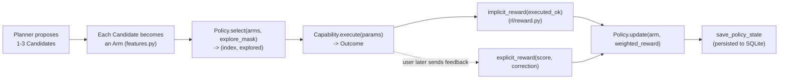

# The reinforcement-learning flow

How the agent actually *learns*, as opposed to how it plans and acts (see
[SEQUENCES.md](SEQUENCES.md) for that). This is the "RL" in agentic-rl: a
contextual bandit sitting between the LLM's suggestions and what actually
runs — see [PLAN.md](PLAN.md) for why that split exists (*"RL over the
agent's decisions, not over LLM weights"*).

## The loop, end to end



The LLM planner never picks what runs — it only proposes candidates. A
`Policy` (`policy/base.py:Policy`) picks one, and that choice, together with
whatever reward it earns, is what the system actually learns from. This
happens **per step** of the multi-step loop (`core/agent.py:_advance`), not
once per user request — a three-step episode runs this whole loop three
times, once per step, each against its own set of candidates.

## Arms: what the policy is actually choosing between

A `Candidate` (`{capability, params, rationale, confidence,
needs_confirmation}`) becomes an `Arm` (`policy/base.py:Arm`) — a stable
identity plus a feature vector:

```python
# policy/features.py
def arm_id(candidate) -> str:
    template_hash = param_template_hash(candidate.capability, candidate.params)
    return f"{candidate.capability}:{template_hash}:{candidate.needs_confirmation}"
```

The identity is deliberately **not** `capability + exact params` — it hashes
the *shape* of the params (`_param_template`), not their values:

| Capability | What's hashed |
|---|---|
| `http_call` | `{method, sorted(header keys), has_body}` |
| `schedule_task` | `{"cron" or "run_at", has_timezone}` |
| everything else | `{sorted(param keys)}` |

So `GET https://api.example.com/orders` and `GET https://api.example.com/users`
are **the same arm** — learning "GET calls to this API need an `Accept`
header" generalizes across URLs instead of memorizing one exact call. This is
also why `needs_confirmation` is part of the identity: the same capability
proposed with and without a confirmation flag is treated as a genuinely
different decision, since one skips the safety gate and one doesn't.

## Features: the 32-dim vector a contextual policy sees

`policy/features.py:build_features` — only `LinUCBPolicy` uses this (the
other two policies are context-free, see below):

| Index | Feature | Notes |
|---|---|---|
| 0 | bias | always `1.0` |
| 1 | `hour_of_day / 23` | time-of-day patterns |
| 2 | `min(state.prior_correction_count, 10) / 10` | has this *request* been corrected before |
| 3 | `candidate.confidence` | the planner's own self-reported confidence |
| 4 | `needs_confirmation` | 0/1 |
| 5 | `capability_success_rate` | rolling `AVG(outcome_ok)` for this capability, from `episode_steps` (`core/store.py:capability_success_rate`) |
| 6 | `min(correction_count, 10) / 10` | same signal as index 2, passed separately (see caveat below) |
| 7 | `source == "scheduler"` | 0/1 — did a scheduled job trigger this, not a live user |
| 8–31 | one-hot hash bucket of `arm_id` | `sha256(arm_id)[:8 bytes] % 24`, one bit set |

The hashed tail (24 buckets) is what actually lets a *linear* model
(LinUCB) distinguish one arm from another at all — dims 0–7 are shared,
generic context. Bucket collisions are possible (two different arms landing
on the same bit) and are an accepted, unaddressed tradeoff of keeping the
feature vector small and fixed-size rather than growing with the number of
distinct arms ever seen.

**Known duplication, not a bug:** dims 2 and 6 currently carry the same
number — `core/agent.py:_arm_for` passes `state.prior_correction_count` as
both `state` (feeding dim 2) and as the separate `correction_count` argument
(feeding dim 6). They were designed to be able to diverge (e.g. a broader
vs. narrower correction-matching window) but nothing in the codebase sets
them differently today.

## Policies

Three interchangeable implementations of `Policy.select`/`Policy.update`
(`AGENTIC_RL_POLICY` setting), used identically by `Agent` and the simulator:

| | `linucb` (default) | `epsilon` | `greedy` |
|---|---|---|---|
| Uses context features? | yes (all 32 dims) | no | no |
| Exploration | confidence-bonus (UCB) — principled, shrinks as an arm is tried more | uniform-random, probability `epsilon` (default 0.1) | never |
| Per-arm state | `(A, b)` — a 32x32 matrix + 32-vector | running mean reward + count | none |
| Cold start | `A = I`, `b = 0` → prior mean 0 | unseen arm defaults to optimistic `0.5` | n/a |
| `update()` | rank-1 update: `A += x xᵀ`, `b += reward·x` | incremental mean: `mean += (reward - mean) / n` | no-op — **never learns**, purely a control-group baseline |

**LinUCB's score**: `theta = A⁻¹b`; `score = θᵀx + α·√(xᵀA⁻¹x)` — the first
term is the learned estimate, the second is the exploration bonus (shrinks
as `A` accumulates evidence for that arm). `alpha` defaults to `1.0`
(`LinUCBPolicy.__init__`).

**The `explored` flag has a precise, policy-specific meaning** — it's not
just "did we roll dice":
- **LinUCB**: `True` iff the UCB-scored winner differs from the
  mean-only (`θᵀx`) winner — i.e. the bonus term actually changed the
  outcome, not just agreed with it.
- **Epsilon-greedy**: `True` iff the random roll (`< epsilon`) actually
  fired.
- **Greedy**: always `False`.

This flag flows through to `Action.explored` → `Step.action.explored`, is
shown in the web UI's candidate badges ("chosen" vs "explored"), and is what
`rl/export.py`'s future fine-tuning dataset would use to distinguish
deliberate exploration from confident exploitation.

## Exploration is gated by `Mode`, before the policy ever sees it

`core/agent.py:_explore_allowed` builds `explore_mask` per candidate —
`Policy.select` receives it and must not explore a masked-out arm (LinUCB
zeroes the bonus term; epsilon-greedy excludes it from the random pool):

| `Mode` | `explore_mask` | `needs_confirmation` (write tier) |
|---|---|---|
| `sim` | always `True` — simulator only | never (no user to confirm) |
| `dev` (default) | `True` only for read-tier candidates | planner's own `needs_confirmation` flag |
| `prod_strict` | always `False` | always `True`, regardless of the flag |

So in production, exploration never touches a side-effecting action —
learning which *write*-tier arm is best only happens from the reward signal
of whatever the planner/user actually chose to run, never from the policy
deliberately trying an alternative.

## Reward: implicit vs. explicit, and how multi-step changed the accounting

`rl/reward.py`:

- **Implicit** (`implicit_reward`) — inferred from what happened, no user
  input: `EXEC_OK=+0.2` / `EXEC_FAIL=-0.5` on execution,
  `REISSUED=-0.3` if the same request came again within 10 minutes
  (`core/store.py:maybe_penalize_reissue`), `CANCELLED=-0.5` if a
  `schedule_task` job was later cancelled (`Agent.cancel_task`).
- **Explicit** (`explicit_reward`) — from `POST /feedback`: `score` (-1/0/1)
  directly, **except** a correction always forces `-1.0` regardless of the
  raw score (a correction *is* a statement that the action was wrong).
- **`final_reward`** — explicit if the user ever gave any, else whatever was
  inferred implicitly.
- **Weighting** (`weighted_reward`, what `Policy.update` is actually called
  with) — explicit feedback counts **3x** as much as an implicit-only
  update (`EXPLICIT_WEIGHT=3.0` vs `IMPLICIT_WEIGHT=1.0`): a deliberate,
  low-noise human signal should move the policy further than "it didn't
  error."

**Per-step vs. episode-level** (see [PLAN.md](PLAN.md) for the full
multi-step design): each *step* gets its own `implicit_reward` the moment it
executes, and `Policy.update` fires immediately for that step's arm
(`core/agent.py:_finalize_step`) — the policy doesn't wait for the episode to
finish. `Episode.implicit_reward` is the **mean** of its steps' implicit
rewards. Feedback, though, is **episode-level only** — there's no UI or API
to rate one step of a multi-step episode differently from another — so
`Agent.record_feedback` applies the *same* `weighted_reward` to **every**
step's arm:

```python
# core/agent.py:record_feedback
weighted = reward_mod.weighted_reward(episode.explicit_score, episode.correction, episode.implicit_reward)
for step in episode.steps:
    self._policy.update(self._arm_for(episode.state, step.action.candidate), weighted)
```

**This is a real, accepted simplification, not an oversight**: a 👎 on a
three-step episode blames the `web_search` step exactly as much as the
`answer` step that actually phrased the reply badly. There's no credit
assignment across steps (no discounting, no "which step was actually at
fault") — each step's arm just gets the full episode reward. Finer-grained
per-step feedback would require UI changes (rate individual steps, not just
the finished episode) and isn't planned as of this writing.

## Persistence

`Policy.state_dict()` / `Policy.load_state()` round-trip through the
`policy_state` SQLite table (`core/store.py: save_policy_state` /
`load_policy_state`), keyed by `Policy.id` (`"linucb"` / `"epsilon"` /
`"greedy"`). Saved after **every** `Policy.update` call
(`core/agent.py:_persist_policy` — cheap, one row upsert) and loaded once at
`create_app()` startup (`api/app.py`). Switching `AGENTIC_RL_POLICY` starts a
fresh policy from scratch — state is keyed by policy id, so nothing carries
over between e.g. `linucb` and `epsilon` even against the same database.

## Measuring that it actually learns

`sim/run.py` — an offline harness with a fake HTTP transport
(`sim/env.py`), a `MockPlanner` proposing a fixed `[bad, good]` candidate
pair per scripted request, and a `ScriptedUser` (`sim/user.py`) with hidden
preferences (e.g. "always send `Accept: application/json`") that grades each
choice deterministically. Run it directly:

```bash
.venv\Scripts\python -m agentic_rl.sim.run --policy linucb --episodes 500
```

prints first-100 vs. last-100 mean reward and a 10-bucket learning curve.
`tests/test_learning.py` encodes the actual pass/fail bar: LinUCB's last-100
mean must exceed its first-100 mean (it learns), `greedy`'s must stay flat
(no learning, by design), and epsilon-greedy must settle above `0.7` mean
reward. This is also how `Consolidator`/`MemoryStore` convergence is
checked — the simulator asserts exactly one standing rule accumulates per
scripted preference, not one per episode (see
[MEMORY-PLAN.md](MEMORY-PLAN.md)).

## What this is *not*

Worth being explicit about, since "RL" can imply more than what's here:
- **A contextual bandit, not a full MDP.** Each arm choice is scored
  independently; there's no value function bootstrapping across steps or
  episodes, no discounted return, no planning over future states. Choosing
  `web_search` at step 1 isn't credited or blamed based on how step 3 turns
  out beyond the episode-level reward both arms happen to share (see above).
- **Not fine-tuning.** The LLM's weights never change. What's learned lives
  entirely in `policy_state` (bandit parameters) and `memories` (standing
  rules distilled from corrections) — two SQLite tables, both swappable/
  resettable independent of the model.
