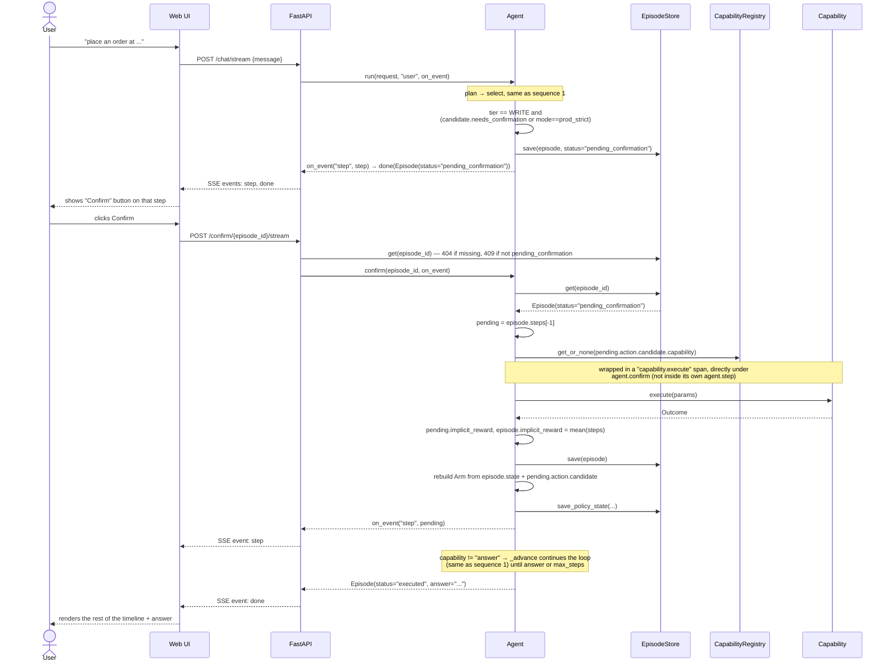
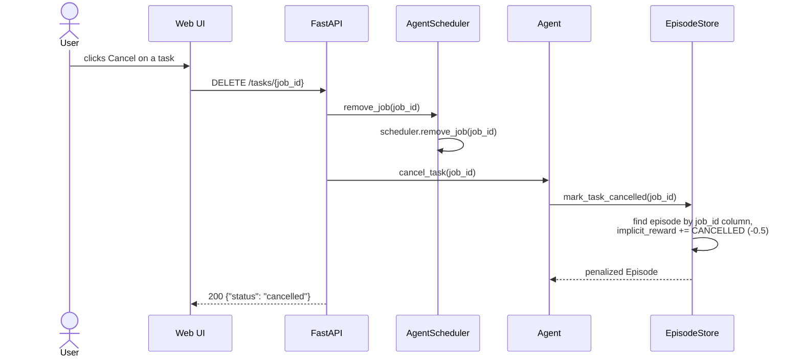
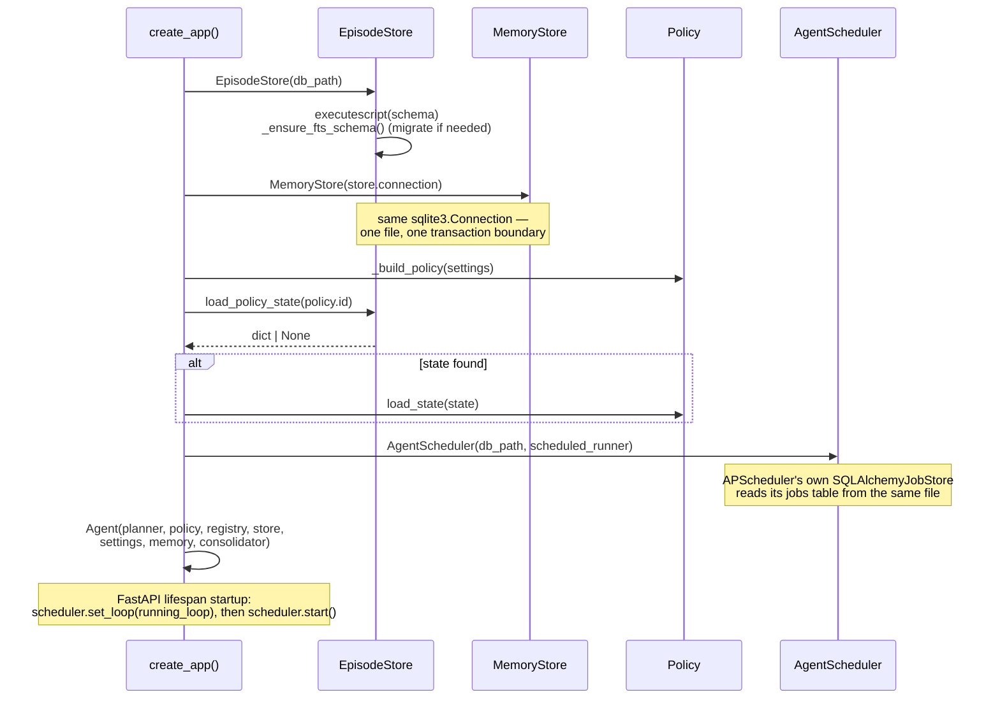

# Sequences

Step-by-step message flows through the system. Pair with [ARCHITECTURE.md](ARCHITECTURE.md)
for what each box actually is. All diagrams use the object names as they appear in
code (`Agent`, `EpisodeStore`, ...), not the class *types* — where a `Planner` or
`Policy` is swappable, the diagram just says "Planner"/"Policy".

## 1. Chat → multi-step loop → answer (streamed)

The common case: no step needs confirmation, so `Agent._advance` (called from
`Agent.run`) loops plan → select → execute → observe on its own — first a
`web_search`, then an `answer` once it has enough to reply — with no user
interaction in between. `POST /chat/stream` streams one SSE `step` event per
step plus a final `done` event carrying the finished `Episode`; the blocking
`POST /chat` (used by curl/tests) just returns that same finished `Episode`.

```mermaid
sequenceDiagram
    actor User
    participant UI as Web UI
    participant API as FastAPI /chat/stream
    participant Agent
    participant Store as EpisodeStore
    participant Memory as MemoryStore
    participant Planner
    participant Policy
    participant Registry as CapabilityRegistry
    participant Cap as Capability

    User->>UI: types a request
    UI->>API: POST /chat/stream {message}
    API->>Agent: run(request, source="user", on_event)
    Agent->>Store: maybe_penalize_reissue(request, "user")
    Agent->>Store: correction_count(request), search_corrections(request)
    Agent->>Memory: active_rules()

    loop _advance: until an `answer` step executes or max_steps is hit
        Agent->>Planner: plan(state, tool_schemas, corrections, rules, history=steps)
        Planner-->>Agent: [Candidate, ...] (params may reuse a prior step's outcome)
        Agent->>Agent: build Arm per candidate; explore_mask (Mode-dependent)
        Agent->>Policy: select(arms, explore_mask)
        Policy-->>Agent: (index, explored)
        Agent->>Registry: get_or_none(candidate.capability)
        Registry-->>Agent: Capability
        alt tier == READ (or WRITE and not needs_confirmation)
            Note over Agent,Cap: wrapped in a "capability.execute" span (docs/OBSERVABILITY.md)
            Agent->>Cap: execute(params)
            Cap-->>Agent: Outcome(ok, status, payload)
            Agent->>Agent: step.implicit_reward = reward.implicit_reward(...)<br/>episode.implicit_reward = mean(step rewards)
            Agent->>Store: save(episode)
            Agent->>Policy: update(arm, weighted_reward)
            Agent->>Store: save_policy_state(policy.id, state_dict())
            Agent-->>API: on_event("step", step)
            API-->>UI: SSE event: step
        else tier == WRITE and needs_confirmation
            Agent->>Store: save(episode, status="pending_confirmation")
            Agent-->>API: on_event("step", step)
            API-->>UI: SSE event: step
            Note over Agent: loop pauses here — see sequence 2
        end
    end

    Agent-->>API: Episode(status="executed", answer="...")
    API-->>UI: SSE event: done
    UI-->>User: renders the step timeline + answer + 👍/👎/✏️
```

## 2. Chat → write-tier step → confirm → loop resumes

A side-effecting step (e.g. `POST`/`DELETE` `http_call`, or any `schedule_task`)
is proposed but not executed until the user confirms — pausing `_advance`
mid-loop rather than ending the episode. The step is persisted with
`outcome=null` and the episode at `status="pending_confirmation"`; confirming
re-executes just that step and then lets `_advance` continue planning
(typically straight to `answer`).



If the episode is not `pending_confirmation` (already executed, or unknown id),
`/confirm/{id}/stream` returns `404`/`409` before opening the stream; the
blocking `Agent.confirm` (used by `POST /confirm/{episode_id}`) raises
`KeyError` → `404`, or `ValueError` → `409` (see `api/routes.py`).

## 3. Feedback with a correction → policy update + memory consolidation

This is where the two learning mechanisms meet: `Policy.update` (procedural
memory) and `Consolidator.consolidate` (semantic memory) both fire off one
`POST /feedback` call, in that order.

```mermaid
sequenceDiagram
    actor User
    participant UI as Web UI
    participant API as FastAPI /feedback
    participant Agent
    participant Store as EpisodeStore
    participant Policy
    participant Consolidator
    participant Memory as MemoryStore
    participant Distiller

    User->>UI: clicks 👎 / ✏️, types a correction
    UI->>API: POST /feedback {episode_id, score, correction}
    API->>Agent: record_feedback(feedback)
    Agent->>Store: apply_feedback(feedback)
    Note over Store: explicit_score, correction set<br/>final_reward = explicit_reward(...) (±1, correction forces -1)
    Store-->>Agent: updated Episode
    loop for each step in episode.steps
        Agent->>Agent: rebuild Arm from episode.state + step.action.candidate
        Agent->>Policy: update(arm, weighted_reward)
    end
    Note over Policy: explicit feedback weighted ×3<br/>vs. implicit-only updates (rl/reward.py);<br/>feedback is episode-level — every step's arm<br/>gets the same reward
    Agent->>Store: save_policy_state(...)

    alt feedback.correction is set
        Agent->>Consolidator: consolidate(correction, episode)
        Consolidator->>Memory: search(correction, limit=5)
        Memory-->>Consolidator: candidate existing rules
        Consolidator->>Memory: active_rules(capability=c)<br/>for each capability across episode.steps
        Memory-->>Consolidator: more candidates
        Consolidator->>Distiller: distill(correction, episode, existing)
        Distiller-->>Consolidator: DistillResult(rule_text, matches_existing_id?, supersedes_id?)
        Consolidator->>Consolidator: drop any id not in `existing` (hallucination guard)
        alt matches_existing_id (valid)
            Consolidator->>Memory: bump_support(id, episode.id)
        else supersedes_id (valid)
            Consolidator->>Memory: add(new rule)
            Consolidator->>Memory: supersede(old_id, new_id)
        else
            Consolidator->>Memory: add(new rule)
        end
        Consolidator-->>Agent: Memory
    end

    Agent-->>API: updated Episode
    API-->>UI: 200 Episode JSON
    UI-->>User: reward/rules panels refresh
```

## 4. Scheduled task: create → fire → learn

`schedule_task` is a capability like any other — it goes through the same plan
→ select → execute path as sequence 1/2, as one step in the episode's loop
(`_advance` then keeps going, typically straight to an `answer` step
confirming the job was scheduled). What's specific to `schedule_task` is what
happens *after* `execute`: a real job is registered with APScheduler, and
firing that job re-enters `Agent.run` on a background thread.

```mermaid
sequenceDiagram
    actor User
    participant UI as Web UI
    participant API as FastAPI
    participant Agent
    participant Cap as ScheduleTaskCapability
    participant Sched as AgentScheduler
    participant APS as APScheduler<br/>(background thread)
    participant EvLoop as asyncio event loop<br/>(main thread)

    User->>UI: "every day at 9am fetch ..."
    UI->>API: POST /chat/stream
    API->>Agent: run(request, "user", on_event)
    Note over Agent: step 0: plan → select (candidate.capability == "schedule_task")
    Note over Agent,Cap: wrapped in a "capability.execute" span (docs/OBSERVABILITY.md)
    Agent->>Cap: execute({instruction, cron/run_at, timezone})
    Cap->>Sched: add_job(instruction, cron=..., timezone=...)
    Sched->>APS: scheduler.add_job(_run_scheduled_instruction, trigger, args=[instruction])
    APS-->>Sched: job.id
    Sched-->>Cap: job_id
    Cap-->>Agent: Outcome(ok=True, payload={job_id})
    Note over Agent,API: episode saved; job_id column derived by scanning<br/>episode.steps for the schedule_task step (EpisodeStore.save)
    Note over Agent: _advance continues: step 1 plans "answer"<br/>("scheduled for 9am daily")
    Agent-->>API: Episode(status="executed", answer="...")
    API-->>UI: SSE event: done, job now listed in GET /tasks

    Note over APS: ... time passes, cron/run_at fires ...
    APS->>APS: _run_scheduled_instruction(instruction)<br/>(module-level fn, picklable job ref)
    APS->>Sched: _dispatch(instruction)
    Sched->>EvLoop: run_coroutine_threadsafe(agent.run(instruction, source=scheduler))
    EvLoop->>Agent: run(instruction, source="scheduler")
    Note over Agent: same multi-step loop,<br/>state.source="scheduler" (feeds Arm features)
    Agent->>Agent: _execute_step(...) / _finalize_step(...) per step, as usual
```

### Cancellation



Cancelling a task never touches the policy directly — the penalty lands on the
*episode that originally scheduled it*, so the next time the same kind of
`schedule_task` candidate is proposed, its `capability_success_rate` and (once
feedback lands) its arm's learned mean both reflect that it was cancelled.

## 5. App startup: loading persisted state

Both halves of memory that need to survive a restart — the bandit's learned
weights and the standing rules — come from the same SQLite file, loaded once in
`create_app` before the server starts accepting requests.



`MemoryStore`'s rules need no explicit load step — `Agent.run` calls
`memory.active_rules()` fresh on every request, so whatever was persisted is simply
read directly off disk the first time it's needed.
