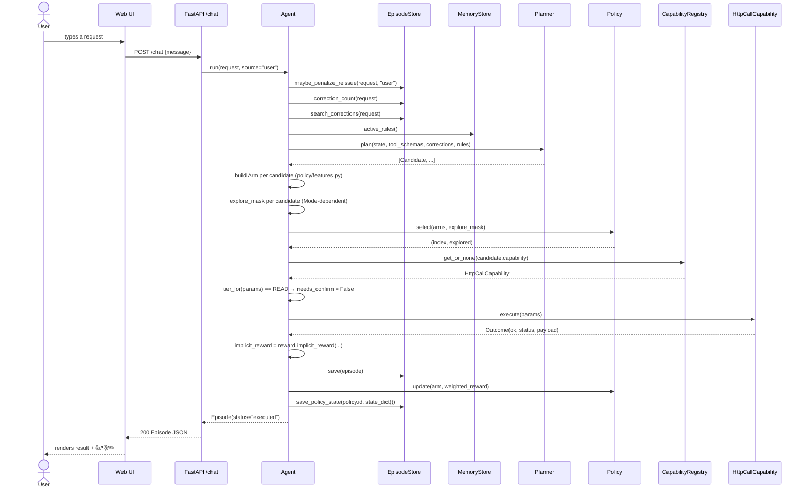
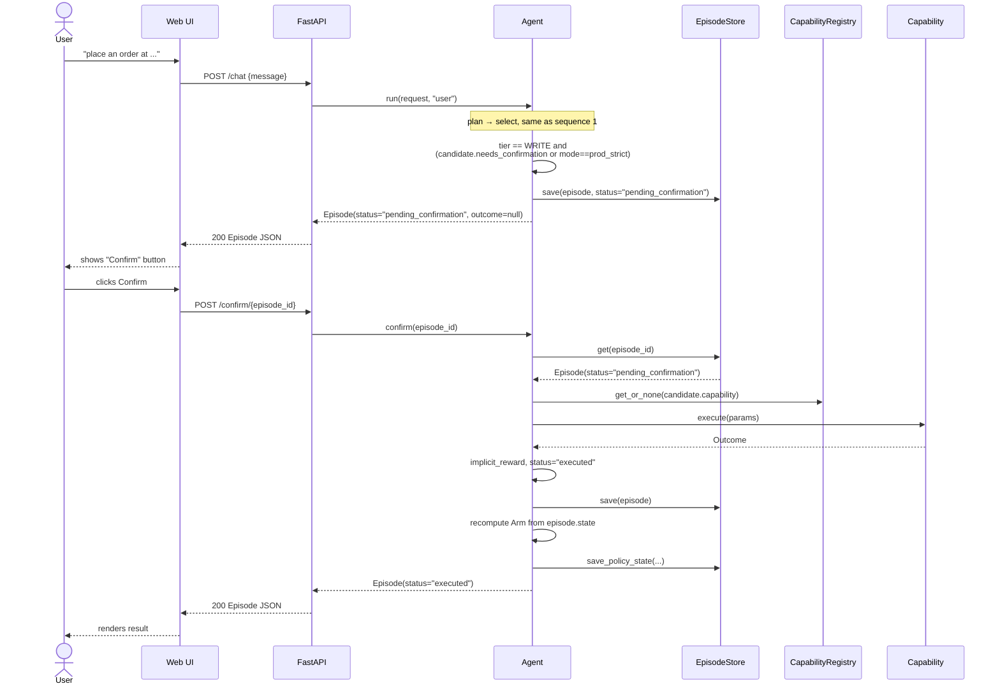
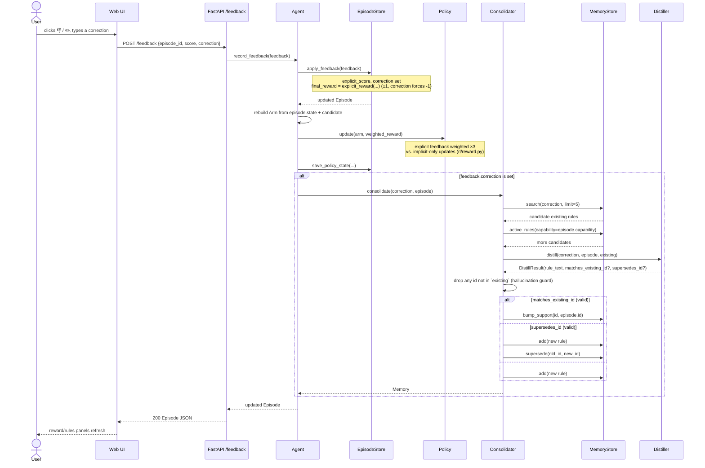
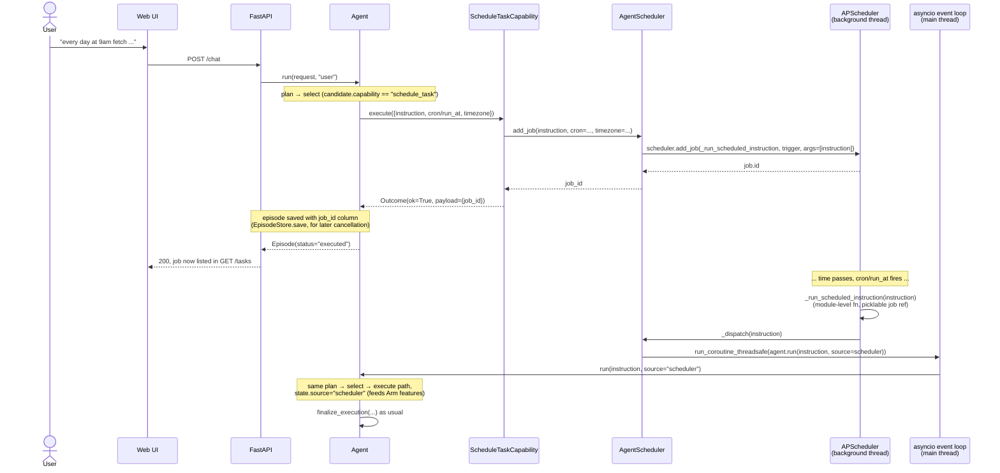
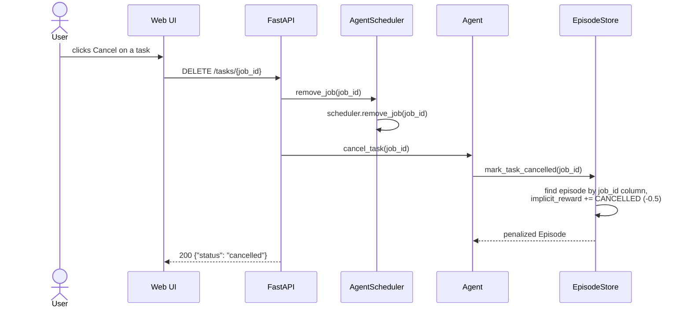
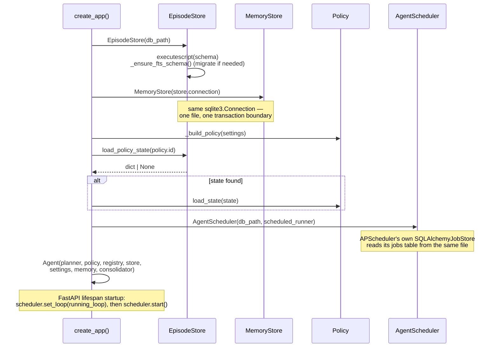

# Sequences

Step-by-step message flows through the system. Pair with [ARCHITECTURE.md](ARCHITECTURE.md)
for what each box actually is. All diagrams use the object names as they appear in
code (`Agent`, `EpisodeStore`, ...), not the class *types* — where a `Planner` or
`Policy` is swappable, the diagram just says "Planner"/"Policy".

## 1. Chat → read-tier action → auto-executed

The common case: a GET-like request needs no confirmation and completes in one
round trip. `POST /chat` → `Agent.run(request, source="user")`.

## 2. Chat → write-tier action → confirm

A side-effecting action (e.g. `POST`/`DELETE` `http_call`, or any `schedule_task`)
is proposed but not executed until the user confirms. The episode is persisted at
`pending_confirmation` and re-fetched by `Agent.confirm`.

If the episode is not `pending_confirmation` (already executed, or unknown id),
`Agent.confirm` raises `KeyError` → `404`, or `ValueError` → `409` (see `api/routes.py`).

## 3. Feedback with a correction → policy update + memory consolidation

This is where the two learning mechanisms meet: `Policy.update` (procedural
memory) and `Consolidator.consolidate` (semantic memory) both fire off one
`POST /feedback` call, in that order.

## 4. Scheduled task: create → fire → learn

`schedule_task` is a capability like any other — it goes through the same plan
→ select → execute path as sequence 1/2. What's specific to it is what happens
*after* `execute`: a real job is registered with APScheduler, and firing that job
re-enters `Agent.run` on a background thread.

### Cancellation

Cancelling a task never touches the policy directly — the penalty lands on the
*episode that originally scheduled it*, so the next time the same kind of
`schedule_task` candidate is proposed, its `capability_success_rate` and (once
feedback lands) its arm's learned mean both reflect that it was cancelled.

## 5. App startup: loading persisted state

Both halves of memory that need to survive a restart — the bandit's learned
weights and the standing rules — come from the same SQLite file, loaded once in
`create_app` before the server starts accepting requests.

`MemoryStore`'s rules need no explicit load step — `Agent.run` calls
`memory.active_rules()` fresh on every request, so whatever was persisted is simply
read directly off disk the first time it's needed.
